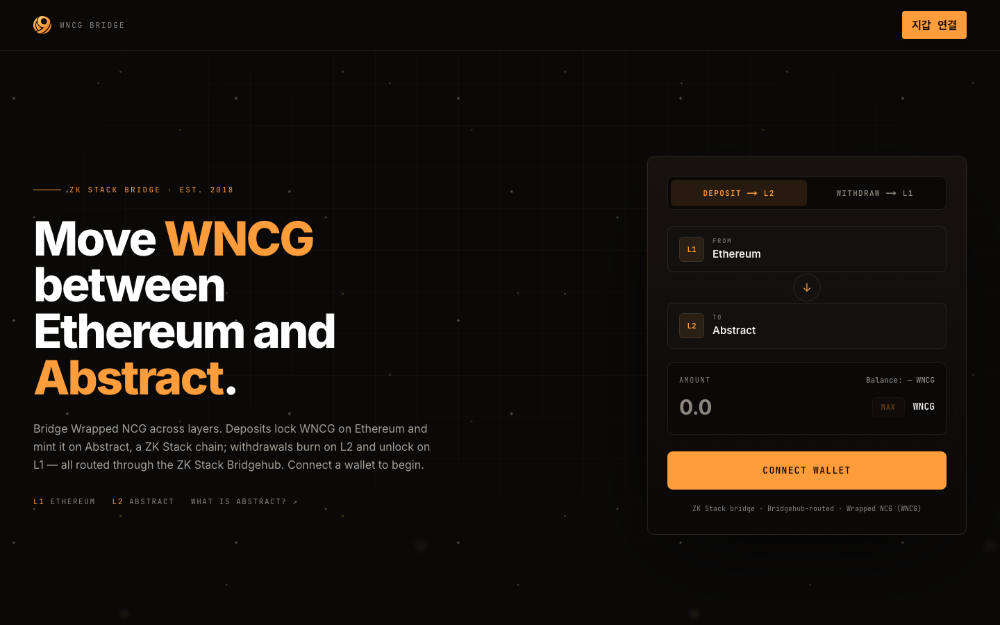

# WNCG Bridge — Ethereum ↔ Abstract

A ZK Stack bridge for **Wrapped NCG (WNCG)** between **Ethereum (L1)** and
**Abstract (L2)**. Connect a wallet with RainbowKit and move WNCG across layers.
The UI reuses the warm-black + amber look & feel of the
[9C Portal](https://nine-corporation.com) / Nine Corporation site.



## How it works

Abstract is a [ZK Stack](https://docs.zksync.io/zk-stack) chain, so bridging is
routed through the ZK Stack **Bridgehub** using viem's `viem/zksync` actions:

- **Deposit (L1 → L2):** `walletActionsL1().deposit` approves WNCG on Ethereum and
  requests an L2 mint on Abstract via the Bridgehub. Funds arrive on L2 after the
  L1 tx is finalized (a few minutes).
- **Withdraw (L2 → L1):** `walletActionsL2().withdraw` burns WNCG on Abstract and
  emits an L2→L1 message. The withdrawal is later **finalized on L1** once the L2
  proof is published (this can take hours, per ZK Stack finality).

### Token contracts

| Layer | Chain | WNCG address |
| --- | --- | --- |
| L1 | Ethereum (`1`) | `0xf203Ca1769ca8e9e8FE1DA9D147DB68B6c919817` |
| L2 | Abstract (`2741`) | `0x3a058F406654B908a60cBE296faC03C7bF1c6769` |

WNCG is an 18-decimal ERC-20.

## Stack

- **Next.js 16** (App Router) · **React 19** · **Tailwind CSS v4**
- **RainbowKit** + **wagmi** + **viem** (with `viem/zksync` for ZK Stack bridging)
- **framer-motion** for the portal-style entrance animation and ambient hero

## Getting started

```bash
npm install
cp .env.local.example .env.local   # then fill in the WalletConnect project id
npm run dev                         # http://localhost:3000
```

### Environment variables

| Variable | Purpose |
| --- | --- |
| `NEXT_PUBLIC_WALLETCONNECT_PROJECT_ID` | WalletConnect Cloud / Reown project id. Required for WalletConnect & mobile-QR wallets. Get one free at [cloud.reown.com](https://cloud.reown.com). Injected wallets (MetaMask, Rabby) work without it. |
| `NEXT_PUBLIC_BRIDGE_NETWORK` | `testnet` switches the app to the **Abstract Sepolia ↔ Ethereum Sepolia** pair. Anything else = mainnet. |
| `NEXT_PUBLIC_WNCG_L1_ADDRESS` | Optional override for the L1 WNCG address (e.g. a testnet deployment). |
| `NEXT_PUBLIC_WNCG_L2_ADDRESS` | Optional override for the L2 WNCG address. |

> Without a real `NEXT_PUBLIC_WALLETCONNECT_PROJECT_ID`, the console shows a
> harmless `Reown Config 403` and falls back to defaults — injected wallets still work.

## Project layout

| Path | Role |
| --- | --- |
| `src/app/page.tsx` | Hero + bridge assembly, portal entrance animation |
| `src/app/layout.tsx` | Fonts, metadata, providers |
| `src/app/globals.css` | Design tokens + portal styling lifted from the 9C system |
| `src/components/Providers.tsx` | wagmi + React Query + RainbowKit (themed) |
| `src/components/Nav.tsx` | Top bar with the RainbowKit ConnectButton |
| `src/components/BridgeCard.tsx` | The deposit/withdraw UI + status feedback |
| `src/lib/chains.ts` | L1/L2 chain selection, WNCG addresses, explorers |
| `src/lib/wagmi.ts` | wagmi/RainbowKit config |
| `src/lib/useBridge.ts` | Bridge logic — viem `zksync` deposit/withdraw |

## Build

```bash
npm run build
```

## Notes & next steps

- **Withdrawal finalization** on L1 (`walletActionsL1().finalizeWithdrawal`) is not
  yet surfaced in the UI — withdrawals are initiated on L2; a "claim on L1" step can
  be added that polls L2 proof readiness and calls `finalizeWithdrawal`.
- Verify the **testnet** WNCG addresses before using `NEXT_PUBLIC_BRIDGE_NETWORK=testnet`;
  the defaults reuse the mainnet addresses as placeholders.
